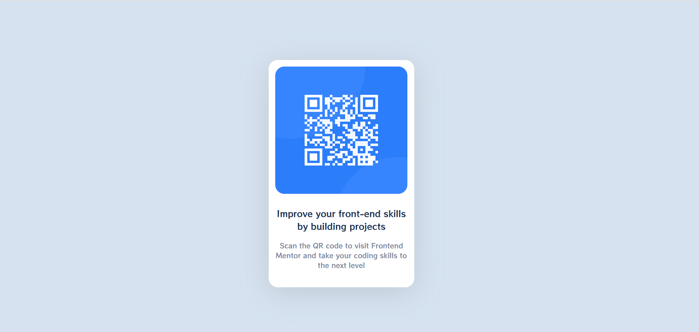

# Frontend Mentor - QR code component solution

This is a solution to the [QR code component challenge on Frontend Mentor](https://www.frontendmentor.io/challenges/qr-code-component-iux_sIO_H). Frontend Mentor challenges help you improve your coding skills by building realistic projects. 

## Table of contents
  - [HTML CSS](#built-with)
- [ABDOU](#author)

### Screenshot

### Links

- Solution URL: [Add solution URL here](https://your-solution-url.com)
- Live Site URL: [Add live site URL here](https://your-live-site-url.com)

## My process

### Built with

- HTML5 
- CSS custom properties

### Continued development

I will keep learning and practising.

### Useful resources

- [W3Schools](https://www.google.com/url?sa=t&rct=j&q=&esrc=s&source=web&cd=&cad=rja&uact=8&ved=2ahUKEwj1sZznydr5AhWUhP0HHW2TBv4QFnoECAQQAQ&url=https%3A%2F%2Fwww.w3schools.com%2F&usg=AOvVaw3Z63kcF6aawsbVZrfSzalJ) 

## Author

- Frontend Mentor - [@IDev11](https://www.frontendmentor.io/profile/IDev11)

